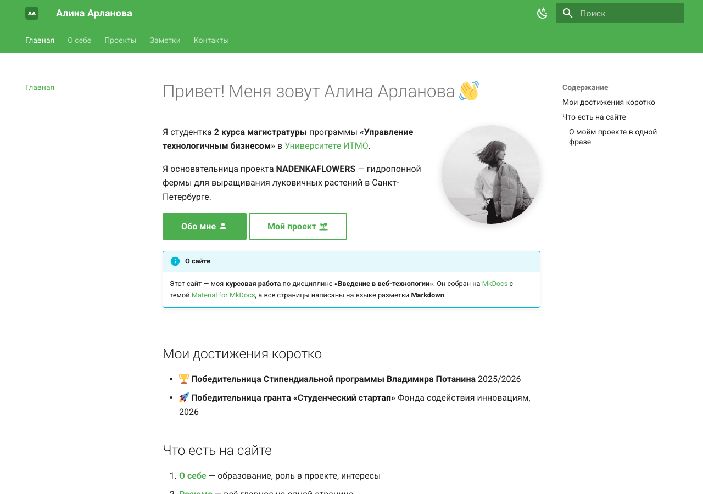
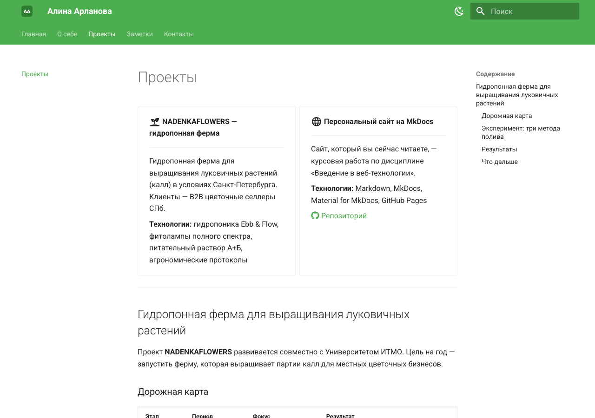
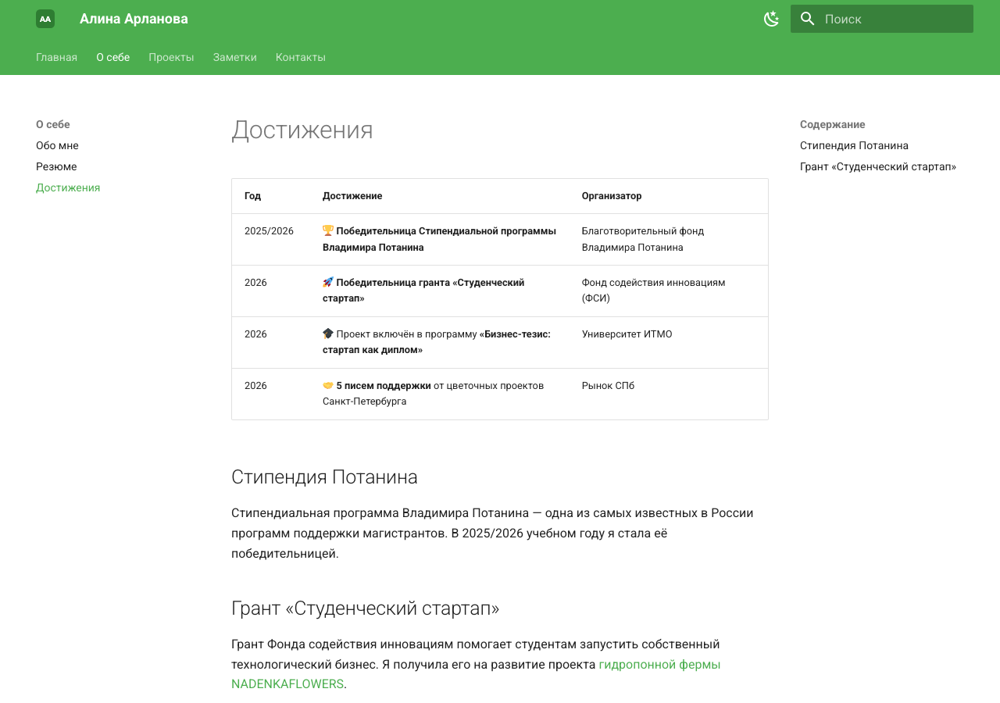
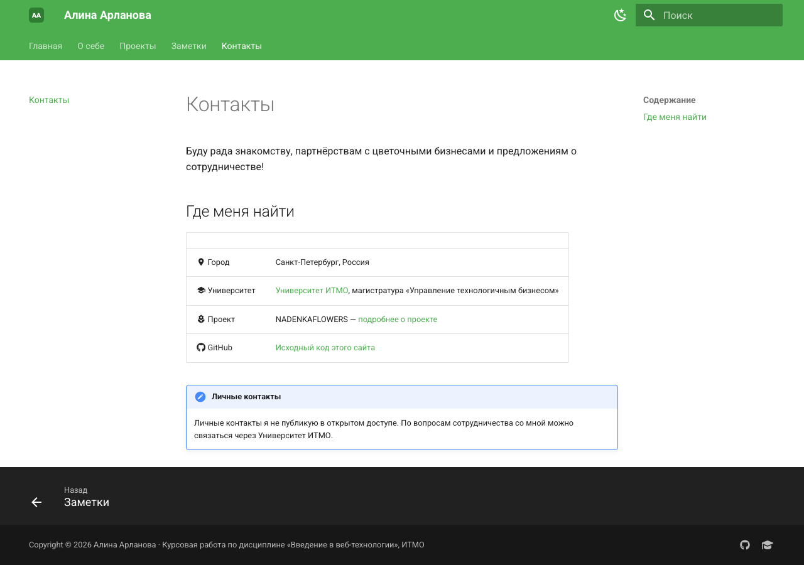

# Отчёт по курсовой работе

> University: [ITMO University](https://itmo.ru/ru/)
> Faculty: [FICT](https://fict.itmo.ru)
> Course: [Введение в веб технологии](https://itmo-ict-faculty.github.io/introduction-in-web-tech/)
> Year: 2025/2026
> Group: U4225
> Author: Арланова Алина Андреевна
> Work: Курсовая работа — Создание персонального сайта с использованием MkDocs
> Date of create: 21.09.2026
> Date of finished: —

## Цель работы

Создать персональный сайт с помощью генератора статических сайтов MkDocs и темы Material for MkDocs. Все страницы написать на Markdown, а публикацию на GitHub Pages настроить через GitHub Actions.

**Сайт:** https://petrunina19257-hub.github.io/devops-lab-arlanova/

## Рабочее окружение

- macOS, Python 3.9
- MkDocs 1.6.1, Material for MkDocs 9.x (версии зафиксированы в `requirements.txt`)
- Git, GitHub Actions, GitHub Pages

## Структура проекта

```text
coursework/
├── mkdocs.yml               # конфигурация: тема, навигация, цвета, футер, расширения
├── requirements.txt         # зависимости: mkdocs, mkdocs-material
├── screenshots/             # скриншоты для отчёта
└── docs/
    ├── index.md             # Главная
    ├── about.md             # О себе
    ├── resume.md            # Резюме
    ├── achievements.md      # Достижения
    ├── projects.md          # Проекты
    ├── contacts.md          # Контакты
    ├── blog/index.md        # Заметки
    ├── images/              # фото, логотип, изображения проекта
    └── stylesheets/extra.css
```

Workflow публикации лежит в корне репозитория: `.github/workflows/deploy-coursework.yml`.

## Ход работы

### 1. Установка и создание проекта

```bash
python3 -m venv .venv
source .venv/bin/activate
pip install mkdocs mkdocs-material
mkdocs --version
mkdocs new .
```

Команда `mkdocs new .` создала файл `mkdocs.yml` и папку `docs/` со страницей `index.md`.

### 2. Настройка `mkdocs.yml`

- Базовые параметры: `site_name`, `site_description`, `site_author`, `site_url`, `copyright`.
- Тема `material` на русском языке. Подключены функции `navigation.tabs`, `navigation.sections`, `navigation.top`, `navigation.footer`, `search.highlight`, `search.share`, `search.suggest`.
- Цветовая схема: `primary: green`, `accent: pink`, есть переключатель светлой и тёмной темы.
- Логотип и favicon — `docs/images/logo.svg`.
- Навигация: Главная, О себе (Обо мне, Резюме, Достижения), Проекты, Заметки, Контакты.
- Плагин `search` с поддержкой русского и английского языков.
- Расширения Markdown: `tables`, `admonition`, `pymdownx.details`, `pymdownx.tasklist`, `attr_list`, `md_in_html`, `pymdownx.emoji` (иконки Material и Font Awesome) и другие.
- Футер: копирайт и иконки со ссылками на GitHub и сайт ИТМО (`extra.social`).

### 3. Создание контента

| Страница | Использованные элементы Markdown |
|----------|----------------------------------|
| Главная | заголовки H1–H3, маркированный и нумерованный списки, ссылки, изображение, цитата, кнопки, блок-примечание |
| О себе | таблицы (образование, роль в проекте), список с иконками, сворачиваемый блок |
| Резюме | заголовки, списки, выделение текста |
| Достижения | таблица с эмодзи, внутренние ссылки, блок-примечание |
| Проекты | карточки (`grid cards`), таблицы, изображения, чек-лист, блоки warning и success |
| Заметки | таблица-шпаргалка по Markdown, код, цитата |
| Контакты | таблица с иконками, блок-примечание |

Личные контакты (почта, телефон, мессенджеры) на сайте намеренно не публикуются.









### 4. Локальное тестирование и сборка

```bash
mkdocs serve           # http://127.0.0.1:8000/devops-lab-arlanova/
mkdocs build --strict  # сборка в папку site/, любое предупреждение считается ошибкой
```

Сборка в режиме `--strict` прошла без предупреждений, значит, все внутренние ссылки и изображения корректны. В браузере проверены все страницы, навигация по вкладкам, переключение темы и поиск: по запросу «Python» находятся результаты на нескольких страницах.

Папка `site/` добавлена в `.gitignore`, потому что её собирает CI.

### 5. Публикация на GitHub Pages

Workflow `.github/workflows/deploy-coursework.yml` запускается при каждом изменении в папке `coursework/` на ветке `main`:

```yaml
- run: pip install -r requirements.txt
- run: mkdocs gh-deploy --force
```

Команда `mkdocs gh-deploy` собирает сайт и публикует его в ветку `gh-pages`. В настройках репозитория (**Settings → Pages**) источником выбрана ветка `gh-pages`.

## Результат

- Рабочий сайт на MkDocs из 7 страниц (по требованию нужно минимум 4)
- Используется тема Material с настроенными цветами, логотипом и футером
- Навигация по вкладкам и разделам, поиск
- На страницах использованы разные элементы Markdown
- Сайт автоматически публикуется на GitHub Pages

## Вывод

В ходе работы я освоила MkDocs и тему Material for MkDocs: научилась структурировать информацию на Markdown, настраивать конфигурацию сайта и автоматически публиковать его на GitHub Pages с помощью GitHub Actions. Получился бесплатный и простой в поддержке персональный сайт.
