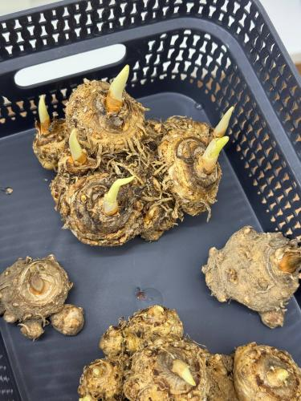
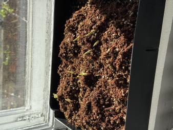

# Проекты

-   :material-sprout:{ .lg .middle } **NADENKAFLOWERS — гидропонная ферма**

    ---

    Гидропонная ферма для выращивания луковичных растений (калл)
    в условиях Санкт-Петербурга. Клиенты — B2B цветочные селлеры СПб.

    **Технологии:** гидропоника Ebb & Flow, фитолампы полного спектра,
    питательный раствор А+Б, агрономические протоколы

-   :material-web:{ .lg .middle } **Персональный сайт на MkDocs**

    ---

    Сайт, который вы сейчас читаете, — курсовая работа по дисциплине
    «Введение в веб-технологии».

    **Технологии:** Markdown, MkDocs, Material for MkDocs, GitHub Pages

    [:fontawesome-brands-github: Репозиторий](https://github.com/petrunina19257-hub/devops-lab-arlanova/tree/main/coursework)

---

## Гидропонная ферма для выращивания луковичных растений

Проект **NADENKAFLOWERS** развивается совместно с Университетом ИТМО.
Цель на год — запустить ферму, которая выращивает партии калл для местных
цветочных бизнесов.

### Дорожная карта

| Этап | Период | Фокус | Результат |
|------|--------|-------|-----------|
| ППМ-1 | Зима 2026 | Рынок и ЦА | Анализ рынка и конкурентов, Lean Canvas, кастдев цветочных селлеров |
| ППМ-2 | Март — май 2026 | Технология и протокол | 3 прототипа фермы, сравнительный эксперимент, рабочий протокол |
| ППМ-3 | Следующий семестр | Масштабирование | Партия 1000+ калл, пилотные B2B-продажи, экономика партии |

### Эксперимент: три метода полива

Мы сравнили три прототипа на одинаковом биоматериале, под одной фитолампой
и при одинаковой температуре:

1. **Ebb & Flow (прилив-отлив)** — раствор подаётся снизу 2 раза в день
2. **Капельный полив** — закрыли до запуска: без дренажа в помещении слишком высок риск затопления
3. **Классический метод** — кокосовый субстрат с вермикулитом, контрольная группа

{ width=300 }
{ width=300 }

*Слева — пробуждённые луковицы калл, отобранные для эксперимента. Справа — новые ростки через 2 дня после пересадки.*

### Результаты

| Метод | Ростков на 10-й день | Вывод |
|-------|:------------------------------------:|-------|
| Ebb & Flow | **8** | Лидер, выбран для протокола |
| Классический | 6 | Работает ровно, но медленнее |
| Капельный | — | Не подходит для помещения без дренажа |

!!! warning "Что пошло не так"
    Через 2 недели на части луковиц появилась плесень. Скорее всего, причины были в
    ремонте помещения, высокой весенней влажности в Петербурге и чувствительности калл к избытку влаги.

!!! success "Как спасли биоматериал"
    Мы применили агрономический протокол из шести шагов: очистка → срез поражённых участков
    → Фитоспорин-М → активированный уголь → просушка 12 часов → пересадка.
    Через **2 дня** появились новые ростки, биоматериал сохранён на **100 %**.

### Что дальше

- [x] Выбран метод полива — Ebb & Flow
- [x] Отработан протокол восстановления луковиц
- [ ] Откалибровать дозировку питательного раствора
- [ ] Пройти полный цикл до цветения
- [ ] Вырастить партию 1000+ калл и начать пилотные B2B-продажи
