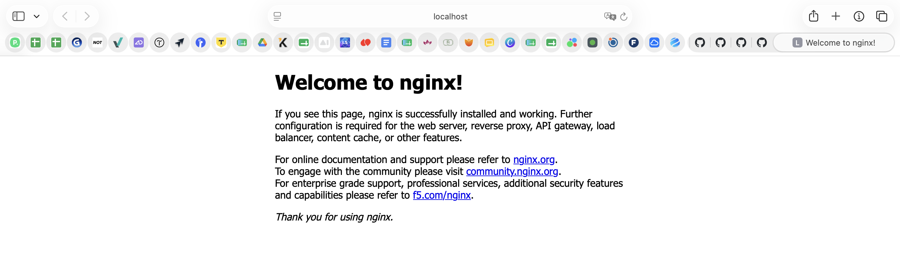

# Отчёт по лабораторной работе №1

> University: [ITMO University](https://itmo.ru/ru/)
> Faculty: [FICT](https://fict.itmo.ru)
> Course: Введение в веб технологии
> Year: 2025/2026
> Group: [U4225](https://isu.ifmo.ru/pls/apex/f?p=2143:GR:111029121666017::NO:RP:GR_GR,GR_DATE:U4225,)
> Author: Арланова Алина Андреевна
> Lab: Lab1 — Основы работы с Docker
> Date of create: 18.09.2026
> Date of finished: 18.09.2026

---

## Цель работы

Научиться работать с Docker: проверять установку, запускать контейнеры из готовых
образов, публиковать порты, управлять жизненным циклом контейнеров и хранить
данные в томах независимо от контейнеров.

## Рабочее окружение

| Компонент | Значение |
|---|---|
| Операционная система | macOS (Apple Silicon, arm64) |
| Docker | version 29.7.2, build a7dcaa6 |
| Ядро внутри контейнеров | Linux 7.0.12-linuxkit |
| Использованные образы | `hello-world`, `ubuntu:latest`, `nginx:alpine` |

Важная особенность платформы: на macOS Docker не запускает контейнеры напрямую —
Docker Desktop поднимает легковесную виртуальную машину Linux, и все контейнеры
работают внутри неё. Отсюда `linuxkit` в имени ядра и адрес шлюза
`192.168.65.1` вместо классического для Linux `172.17.0.1`.

---

## Ход работы

### 1. Проверка установки и базовые команды

Проверка версии клиента:

```bash
docker --version
```

```
Docker version 29.7.2, build a7dcaa6
```

Запуск тестового контейнера:

```bash
docker run hello-world
```

```
Hello from Docker!
This message shows that your installation appears to be working correctly.

To generate this message, Docker took the following steps:
 1. The Docker client contacted the Docker daemon.
 2. The Docker daemon pulled the "hello-world" image from the Docker Hub.
    (arm64v8)
 3. The Docker daemon created a new container from that image which runs the
    executable that produces the output you are currently reading.
 4. The Docker daemon streamed that output to the Docker client, which sent it
    to your terminal.
```

Вывод сам описывает архитектуру Docker: клиент (`docker` в терминале) не делает
работу сам, а передаёт запрос демону, тот скачивает образ, создаёт из него
контейнер, запускает и возвращает поток вывода клиенту. Метка `(arm64v8)`
подтверждает, что скачался вариант образа под архитектуру Apple Silicon.

Список локальных образов:

```bash
docker images
```

```
IMAGE                ID             DISK USAGE   CONTENT SIZE   EXTRA
hello-world:latest   5e2309035332       22.6kB         10.3kB    U
ubuntu:latest        9559ceb7c21e        180MB         44.5MB    U
```

Отмечу расхождение с методическими указаниями: в Docker 29 формат вывода
`docker images` изменён. Вместо колонок REPOSITORY, TAG, IMAGE ID, CREATED, SIZE
выводятся IMAGE, ID, DISK USAGE, CONTENT SIZE и EXTRA, где `U` означает
«In Use» — на образ ссылается хотя бы один контейнер. `DISK USAGE` — занятое
место на диске, `CONTENT SIZE` — размер сжатого содержимого.

Запущенные и все контейнеры:

```bash
docker ps
docker ps -a
```

```
CONTAINER ID   IMAGE         COMMAND    CREATED         STATUS                     NAMES
781b8a6e6158   hello-world   "/hello"   1 minute ago    Exited (0) 1 minute ago    eager_herschel
```

Разница принципиальна: `docker ps` показывает только работающие контейнеры, а
`docker ps -a` — все, включая завершившиеся. Контейнер `hello-world` имеет статус
`Exited (0)`: ноль в скобках — код возврата процесса, то есть штатное
завершение. Остановленный контейнер не исчезает сам и продолжает занимать место,
пока его не удалить явно.

### 2. Работа с готовым образом Ubuntu

Скачивание образа:

```bash
docker pull ubuntu:latest
```

```
latest: Pulling from library/ubuntu
Digest: sha256:9559ceb7c21e528e233e8dff26a0fb2682f4094cce06176eeb075d87a22b31de
Status: Image is up to date for ubuntu:latest
docker.io/library/ubuntu:latest
```

Образ уже был загружен ранее, поэтому вместо скачивания слоёв Docker сверил
digest и сообщил, что локальная копия актуальна.

Запуск интерактивного контейнера:

```bash
docker run -it ubuntu bash
```

Приглашение сменилось на `root@dd90ef2dba23:/#` — это означает работу внутри
контейнера от имени root, где `dd90ef2dba23` его идентификатор. Флаг `-i`
оставляет открытым стандартный ввод, `-t` выделяет псевдотерминал; вместе они
дают интерактивную сессию. Аргумент `bash` заменяет команду, заданную в образе
по умолчанию.

Установка curl внутри контейнера:

```bash
apt update && apt install -y curl
```

```
Summary:
  Upgrading: 0, Installing: 30, Removing: 0, Not Upgrading: 0
  Download size: 6479 kB
  Space needed: 21.1 MB / 226 GB available
...
Setting up curl (8.18.0-1ubuntu2.5) ...
```

Проверка установки:

```bash
curl --version
```

```
curl 8.18.0 (aarch64-unknown-linux-gnu) libcurl/8.18.0 OpenSSL/3.5.5 zlib/1.3.1
brotli/1.2.0 zstd/1.5.7 libidn2/2.3.8 libpsl/0.21.2 libssh2/1.11.1
nghttp2/1.68.0 librtmp/2.3 mit-krb5/1.22.1 OpenLDAP/2.6.10
Release-Date: 2026-01-07, security patched: 8.18.0-1ubuntu2.5
```

Два наблюдения по этому шагу.

Во-первых, в базовом образе Ubuntu curl отсутствует, и для его установки
потребовалось подтянуть 30 пакетов и 21 МБ данных. Официальные образы намеренно
минимальны: в них оставлено только необходимое, чтобы образ был меньше, быстрее
скачивался и содержал меньше потенциально уязвимых компонентов.

Во-вторых, в логе установки появились предупреждения:

```
debconf: unable to initialize frontend: Dialog
debconf: (No usable dialog-like program is installed, ...)
debconf: falling back to frontend: Readline
debconf: unable to initialize frontend: Readline
debconf: (Can't locate Term/ReadLine.pm in @INC ...)
debconf: falling back to frontend: Teletype
```

Это не ошибка установки. Система настройки пакетов debconf последовательно
пробует интерфейсы для диалога с пользователем: сначала оконный Dialog, затем
Readline, и, не найдя ни одного, откатывается к простейшему Teletype. Причина —
та же минимальность образа: ни `dialog`, ни модуль `Term::ReadLine` в него не
входят. Установка при этом проходит полностью.

Выход из контейнера:

```bash
exit
```

Контейнер остановился, потому что завершился процесс `bash`, ради которого он
существовал. Контейнер живёт ровно столько, сколько работает его главный
процесс. Установленный curl остался только внутри этого остановленного
контейнера: образ `ubuntu:latest` не изменился, и в новом контейнере curl снова
будет отсутствовать. Именно эта особенность приводит к необходимости томов
(пункт 5).

### 3. Запуск веб-сервера nginx

Запуск контейнера в фоновом режиме с публикацией порта:

```bash
docker run -d -p 8080:80 --name web-server nginx:alpine
```

```
Unable to find image 'nginx:alpine' locally
alpine: Pulling from library/nginx
a9986cd6f37d: Pull complete
18eb23b7676d: Pull complete
...
Digest: sha256:62ff2089abf5a9ed33bd232895bef5e22f7bb4b200675cec49a5ebc48e3d4ac8
Status: Downloaded newer image for nginx:alpine
4844cd4e51e91b970c96bd738db892b616b6aa49eb84a85b79f41cf6c9bcd73a
```

Образа локально не было, поэтому Docker скачал его послойно — в выводе видно
несколько строк `Pull complete`, по одной на слой. Образ состоит из слоёв,
которые кешируются и переиспользуются между образами.

Разбор использованных флагов:

- `-d` (detached) — запуск в фоне: команда сразу возвращает управление и печатает
  полный 64-символьный идентификатор контейнера. В отличие от `-it` из пункта 2,
  терминал не занимается;
- `-p 8080:80` — публикация порта. Порт 8080 на хосте перенаправляется на порт 80
  внутри контейнера: слева хост, справа контейнер. Без этого флага nginx работал
  бы, но был бы недоступен снаружи, поскольку у контейнера своё сетевое
  пространство;
- `--name web-server` — явное имя вместо случайно сгенерированного;
- `nginx:alpine` — образ, где тег `alpine` означает сборку на базе Alpine Linux:
  она существенно меньше обычной.

Проверка состояния:

```bash
docker ps
```

```
CONTAINER ID   IMAGE          COMMAND                  STATUS         PORTS                                     NAMES
4844cd4e51e9   nginx:alpine   "/docker-entrypoint.…"   Up 5 seconds   0.0.0.0:8080->80/tcp, [::]:8080->80/tcp   web-server
```

Запись `0.0.0.0:8080->80/tcp` подтверждает работу публикации портов. Вторая
запись `[::]:8080->80/tcp` — то же правило для IPv6.

Проверка в браузере по адресу `http://localhost:8080`:



Просмотр логов:

```bash
docker logs web-server
```

```
/docker-entrypoint.sh: Configuration complete; ready for start up
2026/09/18 15:48:47 [notice] 1#1: using the "epoll" event method
2026/09/18 15:48:47 [notice] 1#1: nginx/1.31.6
2026/09/18 15:48:47 [notice] 1#1: built by gcc 15.2.0 (Alpine 15.2.0)
2026/09/18 15:48:47 [notice] 1#1: OS: Linux 7.0.12-linuxkit
2026/09/18 15:48:47 [notice] 1#1: start worker processes
...
192.168.65.1 - - [18/Sep/2026:15:49:06 +0000] "GET / HTTP/1.1" 200 896 "-"
"Mozilla/5.0 (Macintosh; Intel Mac OS X 10_15_7) AppleWebKit/605.1.15 (KHTML,
like Gecko) Version/26.5.2 Safari/605.1.15" "-"
```

Лог читается как хроника запуска: скрипт `docker-entrypoint.sh` донастроил
конфигурацию, nginx 1.31.6 выбрал механизм событий `epoll` и поднял рабочие
процессы. Последняя строка — обращение из браузера: код ответа `200`, размер
ответа 896 байт, User-Agent Safari. То есть лог сам служит подтверждением
проверки в браузере.

Адрес `192.168.65.1` в логе — не адрес Mac в локальной сети, а адрес шлюза той
виртуальной машины, внутри которой Docker Desktop запускает контейнеры. Строка
`OS: Linux 7.0.12-linuxkit` — ядро этой же виртуальной машины.

Подключение к работающему контейнеру:

```bash
docker exec -it web-server sh
```

```
/ # ls /usr/share/nginx/html
50x.html    index.html
```

Здесь использован `sh`, а не `bash`: в Alpine Linux bash по умолчанию не
устанавливается. Разница между командами принципиальная: `docker run` создаёт
новый контейнер, а `docker exec` запускает дополнительный процесс внутри уже
работающего.

Содержимое отдаваемой страницы:

```bash
cat /usr/share/nginx/html/index.html
```

```html
<!DOCTYPE html>
<html>
<head>
<title>Welcome to nginx!</title>
...
<h1>Welcome to nginx!</h1>
<p>If you see this page, nginx is successfully installed and working.</p>
...
</html>
```

После `exit` контейнер продолжил работу: завершилась только оболочка `sh`, а
главный процесс nginx остался жив.

### 4. Управление контейнерами

Остановка контейнера:

```bash
docker stop web-server
```

```
web-server
```

```bash
docker ps -a
```

```
CONTAINER ID   IMAGE          STATUS                     PORTS   NAMES
4844cd4e51e9   nginx:alpine   Exited (0) 8 seconds ago           web-server
```

Статус сменился на `Exited (0)`, публикация портов исчезла, страница на
`localhost:8080` перестала открываться. При остановке Docker посылает главному
процессу сигнал SIGTERM и ждёт корректного завершения, по умолчанию до 10 секунд,
после чего завершает процесс принудительно.

Повторный запуск:

```bash
docker start web-server
docker ps
```

```
CONTAINER ID   IMAGE          STATUS         PORTS                                     NAMES
4844cd4e51e9   nginx:alpine   Up 4 seconds   0.0.0.0:8080->80/tcp, [::]:8080->80/tcp   web-server
```

Ключевое наблюдение: идентификатор остался прежним — `4844cd4e51e9`. Значит
`start` возобновил тот же самый контейнер с его файловой системой и настройками,
в отличие от `run`, который каждый раз создаёт новый контейнер из образа.

Попытка удалить работающий контейнер:

```bash
docker rm web-server
```

```
Error response from daemon: cannot remove container "web-server": container is
running: stop the container before removing or force remove
```

Docker отказался выполнять операцию. Это осознанная защита от случайного
удаления работающего сервиса; сообщение подсказывает два выхода — остановить
контейнер или удалить принудительно флагом `-f`. Выбран безопасный путь:

```bash
docker stop web-server
docker rm web-server
```

```
web-server
web-server
```

Удаление образа:

```bash
docker rmi nginx:alpine
```

```
Untagged: nginx:alpine
Deleted: sha256:62ff2089abf5a9ed33bd232895bef5e22f7bb4b200675cec49a5ebc48e3d4ac8
```

Удаление прошло в два этапа: сначала снялся тег `nginx:alpine` (`Untagged`),
затем удалились сами данные (`Deleted`). Образ можно удалить только когда на него
не ссылается ни один контейнер — соответствующий контейнер был удалён шагом
раньше. В списке образов `nginx:alpine` больше нет, а `hello-world` и `ubuntu`
остались с пометкой `U`, поскольку на них по-прежнему ссылаются контейнеры.

### 5. Работа с томами

Просмотр существующих томов:

```bash
docker volume ls
```

```
DRIVER    VOLUME NAME
local     my-volume
```

Драйвер `local` означает, что том хранится средствами самого Docker на локальной
машине.

Для честной проверки сохранности данных прежний том и контейнер были удалены,
чтобы исключить сомнения, старый это файл или новый:

```bash
docker stop volume-test
docker rm volume-test
docker volume rm my-volume
```

Создание тома:

```bash
docker volume create my-volume
```

```
my-volume
```

Запуск контейнера с подключённым томом:

```bash
docker run -it --name volume-test -d -v my-volume:/data ubuntu bash
```

```
f82a093273a65218c4149846dbb53be6487ebda64f141445b15015535510451b
```

Флаг `-v my-volume:/data` монтирует том внутрь контейнера по пути `/data`: слева
имя тома, справа точка монтирования.

Создание файла в томе:

```bash
docker exec -it volume-test bash
echo "Hello from volume" > /data/test.txt
cat /data/test.txt
ls -la /data
```

```
Hello from volume
total 12
drwxr-xr-x 2 root root 4096 Sep 18 15:55 .
drwxr-xr-x 1 root root 4096 Sep 18 15:54 ..
-rw-r--r-- 1 root root   18 Sep 18 15:55 test.txt
```

Полное удаление контейнера:

```bash
docker stop volume-test
docker rm volume-test
```

Создание нового контейнера с тем же томом:

```bash
docker run -it --name volume-test2 -d -v my-volume:/data ubuntu bash
```

```
2f3fe512069dbf7f18d76d7ec315ee4daa0dba1031c732a16d5724b71c35527f
```

Здесь была допущена ошибка — команда запущена повторно, и Docker ответил:

```
docker: Error response from daemon: Conflict. The container name "/volume-test2"
is already in use by container "2f3fe512069dbf7f18d76d7ec315ee4daa0dba1031c732a
16d5724b71c35527f". You have to remove (or rename) that container to be able to
reuse that name.
```

Имена контейнеров уникальны в пределах хоста, поэтому Docker отказался создать
второй контейнер с тем же именем. Логика та же, что и при попытке удалить
работающий контейнер: демон не выполняет операцию, которая привела бы к
неоднозначному состоянию, и в тексте ошибки сразу подсказывает решение.

Проверка сохранности данных:

```bash
docker exec -it volume-test2 cat /data/test.txt
```

```
Hello from volume
```

Файл прочитан из контейнера, который создан **после** удаления того контейнера,
где файл был записан. Это и есть результат пункта: данные в томе живут отдельно
от контейнеров.

Расположение тома:

```bash
docker volume inspect my-volume
```

```json
[
    {
        "CreatedAt": "2026-09-18T15:54:46Z",
        "Driver": "local",
        "Labels": null,
        "Mountpoint": "/var/lib/docker/volumes/my-volume/_data",
        "Name": "my-volume",
        "Options": null,
        "Scope": "local"
    }
]
```

Путь в `Mountpoint` находится внутри виртуальной машины Docker Desktop, а не в
файловой системе macOS, поэтому открыть его напрямую из Finder нельзя.

---

## Ответы на контрольные вопросы

**Чем образ отличается от контейнера?**
Образ — неизменяемый шаблон, состоящий из слоёв: файловая система плюс
метаданные о том, какую команду запускать. Контейнер — работающий экземпляр,
созданный из образа, со своим изменяемым слоем поверх. Из одного образа можно
создать сколько угодно контейнеров, и изменения внутри контейнера образ не
затрагивают: установленный в пункте 2 curl остался в контейнере, а образ
`ubuntu:latest` не изменился.

**Чем различаются `docker run`, `docker start` и `docker exec`?**
`run` создаёт новый контейнер из образа и запускает его. `start` возобновляет
ранее остановленный контейнер — в работе это подтвердилось сохранением
идентификатора `4844cd4e51e9`. `exec` запускает дополнительный процесс внутри
уже работающего контейнера, не создавая новый.

**Что делает `-p 8080:80`?**
Публикует порт: обращения к порту 8080 на хосте перенаправляются на порт 80
внутри контейнера. У контейнера своё сетевое пространство, поэтому без
публикации порта сервис внутри недоступен извне. Порядок важен — слева хост,
справа контейнер.

**Почему данные внутри контейнера не сохраняются и зачем нужны тома?**
Изменяемый слой контейнера существует только вместе с самим контейнером: после
`docker rm` он исчезает. Том — отдельное хранилище под управлением Docker,
подключаемое в контейнер по указанному пути. В работе это проверено напрямую:
контейнер с файлом был удалён, а новый контейнер с тем же томом прочитал
`Hello from volume`.

**Зачем нужен вариант образа на Alpine?**
Alpine Linux — минималистичный дистрибутив, поэтому образ `nginx:alpine` в
разы меньше обычного: быстрее скачивается, занимает меньше места и содержит
меньше компонентов, а значит и меньше потенциальных уязвимостей. Плата за это —
отсутствие привычных инструментов, поэтому подключаться приходилось через `sh`,
а не `bash`.

**Почему `docker ps` не показывает остановленные контейнеры?**
Потому что по умолчанию выводятся только работающие. Остановленные контейнеры
не удаляются автоматически и продолжают занимать место на диске — увидеть их
можно флагом `-a`. Об этом легко забыть, и за несколько запусков накапливается
десяток забытых контейнеров.

---

## Вывод

В ходе работы освоены базовые операции Docker: проверка установки, запуск
контейнеров из готовых образов, работа в интерактивном режиме и в фоне,
публикация портов, чтение логов, подключение к работающему контейнеру, полный
цикл управления жизненным циклом контейнера и хранение данных в томах.

Главный практический вывод касается разделения образа, контейнера и тома. Образ
неизменяем, контейнер живёт ровно столько, сколько работает его главный процесс,
а всё, что должно сохраниться, нужно выносить в том. Это стало наглядным при
сравнении двух шагов: установленный в контейнере curl исчез вместе с ним, а
файл, записанный в том, был прочитан из совершенно нового контейнера.

Второе наблюдение — предсказуемость поведения Docker при потенциально опасных
операциях. Демон отказался удалять работающий контейнер и отказался создать
второй контейнер с занятым именем, в обоих случаях описав причину и подсказав
решение прямо в тексте ошибки. На такие сообщения стоит опираться, а не
подавлять их принудительными флагами.

Третье — специфика платформы. На macOS контейнеры работают не на самой системе,
а внутри виртуальной машины Docker Desktop, что видно и по ядру
`linuxkit`, и по адресу шлюза `192.168.65.1` в логах nginx, и по недоступности
пути тома из Finder. Знание этой прослойки помогает не удивляться расхождениям
с примерами, написанными для Linux.
