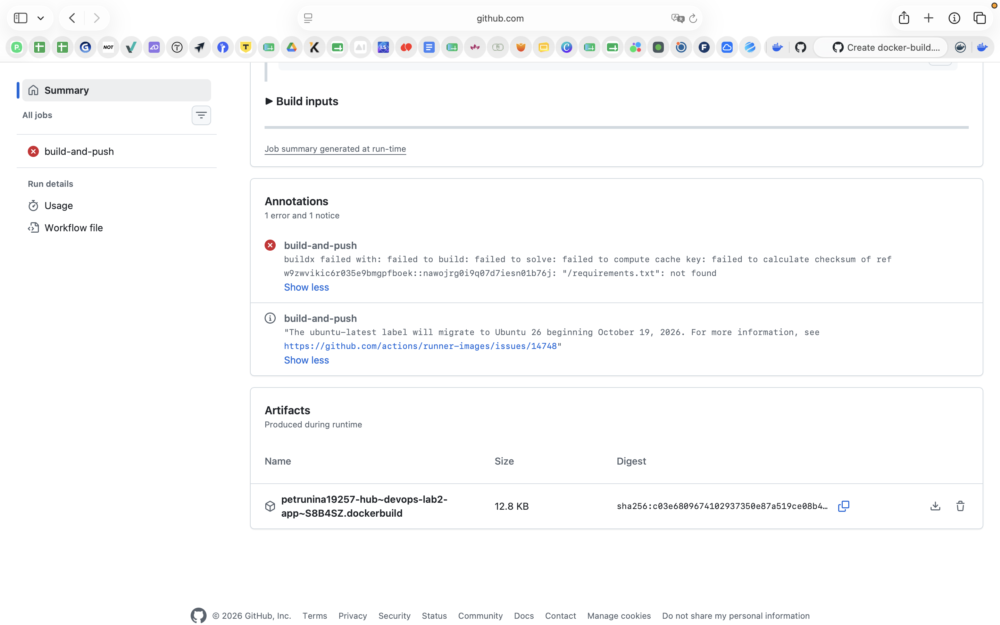
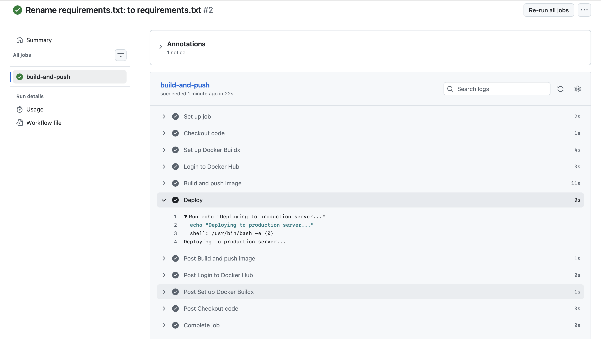
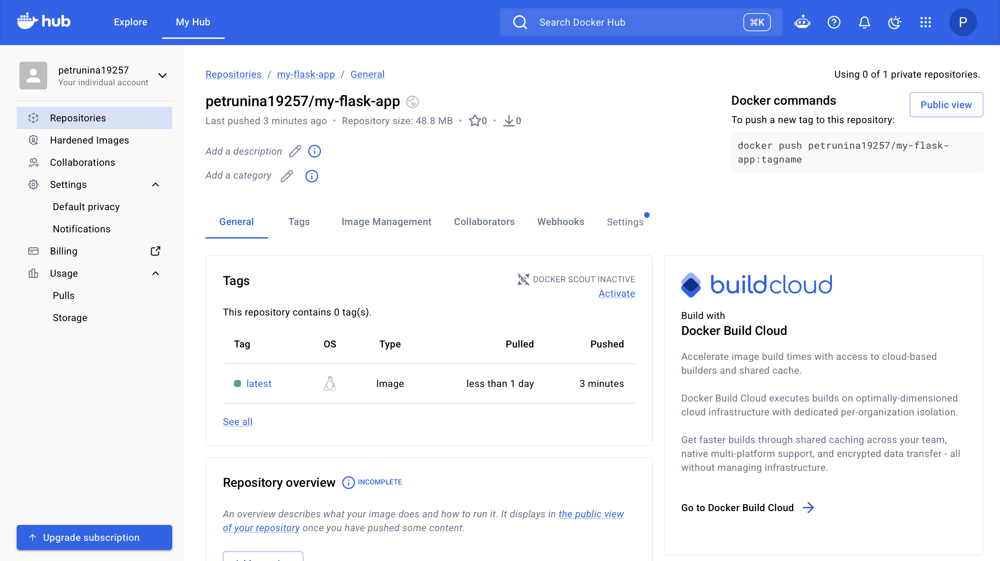

# Отчёт по лабораторной работе №2

> University: [ITMO University](https://itmo.ru/ru/)
> Faculty: [FICT](https://fict.itmo.ru)
> Course: [Введение в веб технологии](https://itmo-ict-faculty.github.io/introduction-in-web-tech/)
> Year: 2025/2026
> Group: U4225
> Author: Арланова Алина Андреевна
> Lab: Lab2 — CI/CD для Docker приложения
> Date of create: 18.09.2026
> Date of finished: —

## Цель работы

Настроить GitHub Actions для автоматической сборки Docker-образа, публикации в Docker Hub и выполнения демонстрационного шага деплоя при пуше в ветку `main`.

Выполнен обычный вариант лабораторной работы.

## Ссылки

- [Репозиторий приложения](https://github.com/petrunina19257-hub/devops-lab2-app)
- [Файл пайплайна](https://github.com/petrunina19257-hub/devops-lab2-app/blob/main/.github/workflows/docker-build.yml)
- [Запуски GitHub Actions](https://github.com/petrunina19257-hub/devops-lab2-app/actions)
- [Docker-образ в Docker Hub](https://hub.docker.com/r/petrunina19257/my-flask-app)

## Ход работы

### 1. Подготовка проекта

В первой лабораторной работе использовались готовые образы `hello-world`, `ubuntu` и `nginx`. Flask-приложение и собственный Dockerfile в ней не создавались, поэтому для второй работы эти файлы были подготовлены отдельно.

Создан новый GitHub-репозиторий `devops-lab2-app`. Работа с файлами и коммитами выполнялась через веб-интерфейс GitHub на macOS. Структура приложения:

```text
devops-lab2-app/
├── .github/
│   └── workflows/
│       └── docker-build.yml
├── app.py
├── requirements.txt
├── Dockerfile
└── README.md
```

Файл `app.py`:

```python
from flask import Flask

app = Flask(__name__)


@app.route("/")
def hello():
    return "Hello from Docker! Lab 2: CI/CD"


if __name__ == "__main__":
    app.run(host="0.0.0.0", port=5000)
```

Приложение обрабатывает запросы к `/`. Адрес `0.0.0.0` позволяет принимать подключения через сетевые интерфейсы контейнера.

Файл `requirements.txt`:

```text
Flask>=3.1,<4
```

Файл `Dockerfile`:

```dockerfile
FROM python:3.12-slim

WORKDIR /app

COPY requirements.txt .
RUN pip install --no-cache-dir -r requirements.txt

COPY app.py .

EXPOSE 5000

CMD ["python", "app.py"]
```

Образ собирается на основе Python 3.12. Сначала устанавливаются зависимости, затем копируется код. Команда `CMD` задаёт запуск приложения при старте контейнера. `EXPOSE 5000` описывает порт приложения, но сама по себе не публикует его на хосте.

В Docker Hub создан публичный репозиторий `petrunina19257/my-flask-app`.

### 2. Настройка секретов

В GitHub-репозитории приложения в разделе **Settings → Secrets and variables → Actions** добавлены секреты:

| Имя | Назначение |
|---|---|
| `DOCKER_USERNAME` | Логин Docker Hub: `petrunina19257` |
| `DOCKER_PASSWORD` | Токен доступа Docker Hub для авторизации и публикации образа |

Значение токена не записывается в код или отчёт. Пайплайн получает его через контекст `secrets`. Название `DOCKER_PASSWORD` сохранено в соответствии с заданием, хотя используется токен.

### 3. Настройка GitHub Actions

В корне репозитория создан файл `.github/workflows/docker-build.yml`:

```yaml
name: Docker Build and Push

on:
  push:
    branches:
      - main

permissions:
  contents: read

jobs:
  build-and-push:
    runs-on: ubuntu-latest

    steps:
      - name: Checkout code
        uses: actions/checkout@v6

      - name: Set up Docker Buildx
        uses: docker/setup-buildx-action@v4

      - name: Login to Docker Hub
        uses: docker/login-action@v4
        with:
          username: ${{ secrets.DOCKER_USERNAME }}
          password: ${{ secrets.DOCKER_PASSWORD }}

      - name: Build and push image
        uses: docker/build-push-action@v7
        with:
          context: .
          push: true
          tags: ${{ secrets.DOCKER_USERNAME }}/my-flask-app:latest

      - name: Deploy
        run: echo "Deploying to production server..."
```

Пайплайн запускается при пуше в `main` и выполняется на runner GitHub с Ubuntu. Разрешение `contents: read` даёт токену GitHub доступ для чтения кода.

| Шаг | Действие |
|---|---|
| Checkout code | Загружает код репозитория на runner |
| Set up Docker Buildx | Настраивает инструмент сборки Docker-образов |
| Login to Docker Hub | Выполняет авторизацию с использованием секретов |
| Build and push image | Собирает образ из корня проекта и публикует `petrunina19257/my-flask-app:latest` |
| Deploy | Выводит демонстрационное сообщение о деплое |

`context: .` задаёт корень проекта как контекст сборки, а `push: true` включает отправку образа в registry. Тег `latest` обновляется при следующих успешных запусках.

Шаг `Deploy` является имитацией деплоя, разрешённой заданием: он не подключается к серверу и не запускает контейнер. Тестирование HTTP-ответа приложения в этот пайплайн не включено.

### 4. Первый запуск и исправление ошибки

После сохранения workflow в ветку `main` автоматически начался запуск №1 для коммита `2a1beb0`. Он завершился ошибкой на этапе сборки:

```text
"/requirements.txt": not found
```

Причиной стало лишнее двоеточие в имени файла: `requirements.txt:`. Инструкция `COPY requirements.txt .` ожидала другое имя и не смогла найти файл.



Файл переименован в `requirements.txt`. Исправление сохранено в `main` коммитом `ce204a2` с сообщением `Rename requirements.txt: to requirements.txt`. Новый коммит автоматически вызвал запуск №2.

### 5. Проверка успешного запуска

Второй запуск завершился успешно. На странице задания `build-and-push` все шаги отмечены как выполненные, включая авторизацию, сборку и публикацию. Задание заняло 22 секунды; на странице списка запусков общая длительность указана как 27 секунд.

В раскрытом логе шага `Deploy` отображается:

```text
Deploying to production server...
```



Сохранение изменений через веб-интерфейс GitHub создало коммит непосредственно в удалённой ветке `main` и вызвало событие `push`. Отдельная команда `git push` в терминале для этого способа работы не требовалась.

### 6. Проверка Docker Hub

В репозитории `petrunina19257/my-flask-app` появился тег `latest`. На странице указаны время последней публикации и размер репозитория 48,8 MB. Это подтверждает публикацию образа после успешного запуска GitHub Actions.



Полное имя опубликованного образа:

```text
petrunina19257/my-flask-app:latest
```

## Ответы на вопросы для защиты

**Что запускает пайплайн?** Пуш в ветку `main`, указанный в секции `on`.

**Где выполняются команды?** На runner GitHub с Ubuntu, а не на локальном Mac.

**Зачем нужны секреты?** Они позволяют передать данные авторизации в workflow без публикации токена в репозитории.

**Чем сборка отличается от публикации?** Сборка создаёт образ по Dockerfile, а публикация отправляет его в Docker Hub для последующего скачивания.

**Что означает latest?** Это имя тега. В данном workflow оно указывает на образ последней успешной публикации; Docker не назначает ему специальную логику выбора самой новой версии.

**Выполнен ли настоящий деплой?** Нет. По условиям обычного варианта настроен демонстрационный шаг с `echo`. Для настоящего деплоя потребовалось бы обновить и запустить приложение в целевом окружении.

## Вывод

Настроен CI/CD-пайплайн GitHub Actions для ветки `main`: получение кода, настройка Buildx, авторизация через секреты, сборка и публикация Docker-образа. Успешный запуск и тег `latest` в Docker Hub подтверждены скриншотами. Выполнен демонстрационный шаг деплоя.

В ходе проверки обнаружена и исправлена ошибка имени файла зависимостей. Исправляющий коммит автоматически запустил пайплайн повторно, что подтвердило работу триггера при изменениях в `main`.
