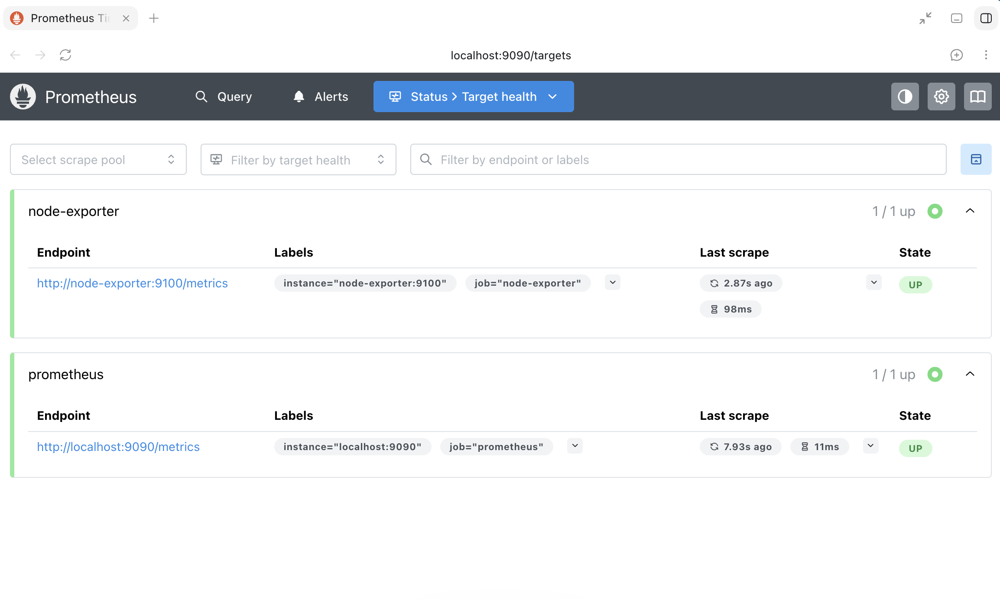
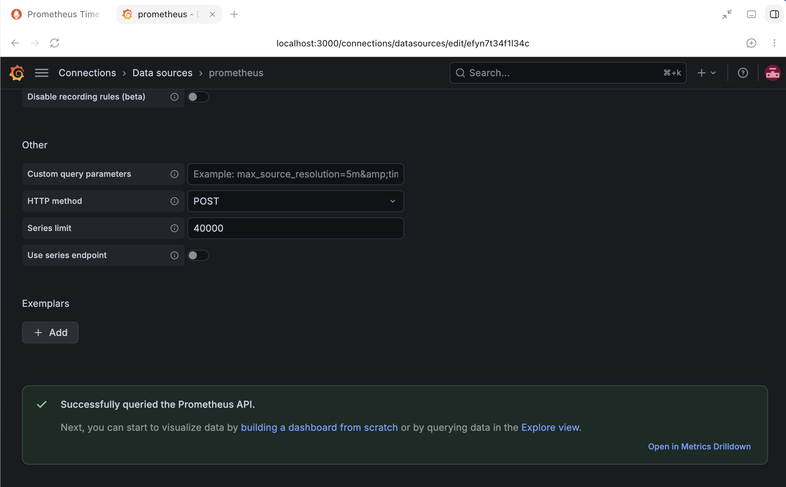
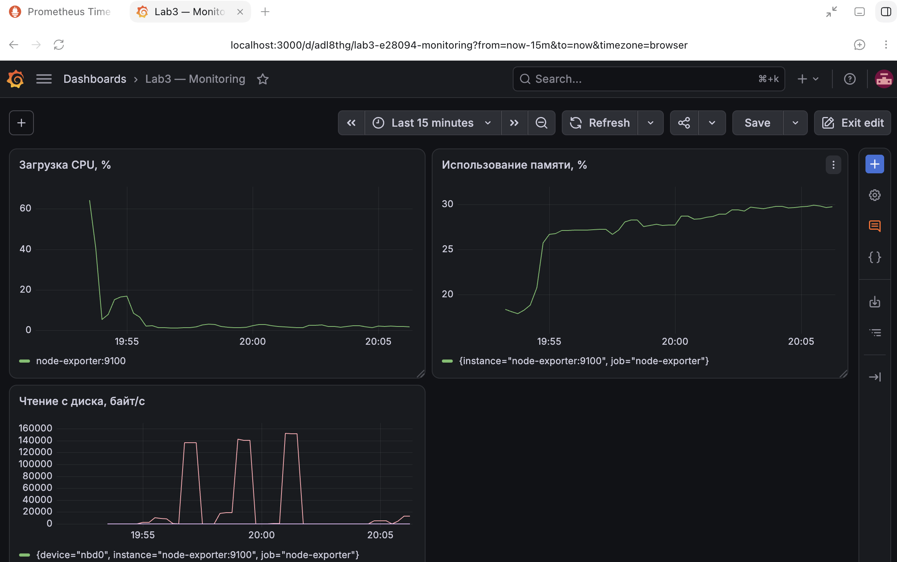

# Отчёт по лабораторной работе №3

> University: [ITMO University](https://itmo.ru/ru/)
> Faculty: [FICT](https://fict.itmo.ru)
> Course: [Введение в веб технологии](https://itmo-ict-faculty.github.io/introduction-in-web-tech/)
> Year: 2025/2026
> Group: U4225
> Author: Арланова Алина Андреевна
> Lab: Lab3 — Мониторинг с Prometheus и Grafana
> Date of create: 18.09.2026
> Date of finished: —

## Цель работы

Настроить локальную систему мониторинга, собирать метрики с помощью Prometheus и отображать загрузку CPU, использование памяти и дисковую активность в Grafana.

## Объём выполненной работы

В отчёте описана выполненная часть задания «Настройка мониторинга с Prometheus и Grafana». Раздел «Тестирование безопасности веб-сайтов» не выполнялся и в результаты этой работы не включён.

## Рабочее окружение и схема

Работа выполнена на macOS с Docker Desktop. Использованы контейнеры из образов `prom/node-exporter`, `prom/prometheus` и `grafana/grafana`.

```text
Node Exporter:9100 ← сбор каждые 15 секунд — Prometheus:9090 ← запросы — Grafana:3000
```

Все три контейнера подключены к сети `monitoring`. Prometheus хранит временные ряды, Grafana запрашивает их и строит графики. Node Exporter предоставляет метрики по HTTP на `/metrics`.

Особенность macOS: контейнеры работают в Linux-среде Docker Desktop. В данной конфигурации Node Exporter запущен без монтирования корневой файловой системы хоста и без host namespaces. CPU, память и дисковая статистика отражают доступное экспортеру Linux-окружение Docker Desktop, а не непосредственные показатели всей macOS и не ресурсы отдельного приложения. Файловые системы видны в пределах контейнера. Это учебная конфигурация с указанными ограничениями.

## Ход работы

### 1. Конфигурация Prometheus

В папке `lab3` создана папка `prometheus` и файл [prometheus/prometheus.yml](prometheus/prometheus.yml):

```yaml
global:
  scrape_interval: 15s

scrape_configs:
  - job_name: prometheus
    static_configs:
      - targets: ['localhost:9090']

  - job_name: node-exporter
    static_configs:
      - targets: ['node-exporter:9100']
```

Интервал сбора — 15 секунд. Первая цель предоставляет метрики самого Prometheus, вторая — Node Exporter. `localhost` в первой цели означает контейнер Prometheus. Имя `node-exporter` разрешается внутри общей Docker-сети.

### 2. Создание сети и томов

```bash
docker network create monitoring
docker volume create prometheus-data
docker volume create grafana-data
```

Тома отделяют данные от жизненного цикла контейнеров: в первом хранятся данные Prometheus, во втором — данные Grafana, включая сохранённые настройки и дашборды.

### 3. Запуск контейнеров

Следующие команды выполнялись из папки `lab3`, содержащей папку `prometheus`.

Node Exporter:

```bash
docker run -d \
  --name node-exporter \
  --network monitoring \
  --restart=unless-stopped \
  -p 127.0.0.1:9100:9100 \
  prom/node-exporter
```

В отличие от Linux-примера задания, пути `/proc` и `/sys` с Mac не монтировались. Также Node Exporter явно подключён к сети `monitoring`, чтобы Prometheus мог обращаться к нему по имени.

Prometheus:

```bash
docker run -d \
  --name prometheus \
  --network monitoring \
  --restart=unless-stopped \
  -p 127.0.0.1:9090:9090 \
  -v prometheus-data:/prometheus \
  -v "$(pwd)/prometheus:/etc/prometheus:ro" \
  prom/prometheus \
  --config.file=/etc/prometheus/prometheus.yml \
  --storage.tsdb.path=/prometheus \
  --storage.tsdb.retention.time=200h
```

Конфигурация подключена только для чтения. Срок хранения временных рядов установлен в 200 часов.

Grafana:

```bash
docker run -d \
  --name grafana \
  --network monitoring \
  --restart=unless-stopped \
  -p 127.0.0.1:3000:3000 \
  -v grafana-data:/var/lib/grafana \
  -e GF_SECURITY_ADMIN_PASSWORD=admin \
  grafana/grafana
```

Порты опубликованы на loopback-адресе Mac. Для первоначального входа использовались учебные учётные данные `admin/admin`. Они не предназначены для публичного сервиса.

### 4. Проверка сбора метрик

На странице `http://localhost:9090/targets` обе цели имели состояние `UP`:

| Цель | Адрес | Результат |
|---|---|---|
| node-exporter | http://node-exporter:9100/metrics | UP |
| prometheus | http://localhost:9090/metrics | UP |



Дополнительно выполнена команда:

```bash
curl -s http://localhost:9100/metrics | head -n 20
```

Фрагмент полученного ответа:

```text
# HELP go_gc_duration_seconds A summary of the wall-time pause (stop-the-world) duration in garbage collection cycles.
# TYPE go_gc_duration_seconds summary
go_gc_duration_seconds{quantile="0"} 3.4833e-05
go_gc_duration_seconds{quantile="0.25"} 0.000113792
go_gc_duration_seconds{quantile="0.5"} 0.000621124
go_gc_duration_seconds{quantile="0.75"} 0.000944416
go_gc_duration_seconds{quantile="1"} 0.003173167
go_gc_duration_seconds_sum 0.080123884
go_gc_duration_seconds_count 120
```

Ответ подтверждает доступность endpoint и выдачу метрик в текстовом формате Prometheus. В начале ответа находятся служебные метрики Go, на котором написан экспортер. Наличие системных метрик `node_*` дополнительно подтверждено запросами и графиками ниже.

### 5. Подключение Grafana

В интерфейсе `http://localhost:3000` открыт раздел **Connections → Data sources**, добавлен источник типа **Prometheus** с адресом:

```text
http://prometheus:9090
```

Это адрес контейнера в сети `monitoring`. Если указать `localhost`, Grafana будет обращаться к самой себе, а не к соседнему контейнеру.

После нажатия **Save & test** получено сообщение `Successfully queried the Prometheus API.`



### 6. Создание дашборда

Создан дашборд **Lab3 — Monitoring** с тремя панелями типа **Time series**. Запросы вводились в режиме **Code**. Для просмотра выбран интервал **Last 15 minutes**.

#### Загрузка CPU, %

Сначала проверена метрика из задания:

```promql
node_cpu_seconds_total{job="node-exporter"}
```

Это накопительный счётчик времени CPU в разных режимах. Для итоговой панели использован запрос:

```promql
100 * (1 - avg by (instance) (rate(node_cpu_seconds_total{job="node-exporter",mode="idle"}[1m])))
```

`rate` вычисляет скорость изменения счётчика за минуту. Доля времени простоя усредняется по ядрам, вычитается из единицы и переводится в проценты. На скриншоте после начального пика около 64% нагрузка снижается до нескольких процентов. Причину пика отдельным экспериментом не проверяли.

#### Использование памяти, %

```promql
100 * (1 - node_memory_MemAvailable_bytes{job="node-exporter"} / node_memory_MemTotal_bytes{job="node-exporter"})
```

Из общего объёма исключается память, доступная для использования без swap. На скриншоте значение постепенно растёт примерно с 18% до 30%.

#### Чтение с диска, байт/с

```promql
rate(node_disk_read_bytes_total{job="node-exporter"}[1m])
```

Скорость чтения вычисляется по накопительному счётчику прочитанных байтов отдельно для каждого устройства. Видны периоды почти нулевой активности и пики порядка 140–150 тысяч байт/с. Нулевое значение означает отсутствие чтения в рассматриваемый период, а не обязательно неисправность сбора.



### 7. Проверка состояния контейнеров

Выполнено:

```bash
docker ps
```

Из полученного вывода:

| Container ID | Image | Status | Ports | Name |
|---|---|---|---|---|
| 298aae1afc63 | grafana/grafana | Up 19 minutes | 127.0.0.1:3000→3000/tcp | grafana |
| 85a28de9875d | prom/prometheus | Up 20 minutes | 127.0.0.1:9090→9090/tcp | prometheus |
| e7987b9c2789 | prom/node-exporter | Up 20 minutes | 127.0.0.1:9100→9100/tcp | node-exporter |

В выводе также присутствовал контейнер `volume-test2` из первой лабораторной; к системе мониторинга он не относится.

## Ответы на вопросы для защиты

**Чем отличаются Prometheus и Grafana?** Prometheus собирает и хранит временные ряды, Grafana запрашивает их и отображает на дашбордах.

**Зачем нужен Node Exporter?** Он предоставляет системные метрики через HTTP в формате, который может читать Prometheus.

**Что означает UP?** Последний сбор метрик с цели прошёл успешно. Это не проверка всех функций или производительности системы.

**Зачем общая сеть?** Она обеспечивает взаимодействие контейнеров и разрешение их имён, например `prometheus` и `node-exporter`.

**Чем counter отличается от gauge?** Counter накапливает значение и может сброситься при перезапуске; для скорости изменения применяется `rate`. Gauge показывает текущее значение, которое может увеличиваться и уменьшаться, например доступную память.

**Почему данные не пропадут при замене контейнера?** Они вынесены в именованные тома; новый контейнер можно подключить к тем же томам. Сохранность при удалении в этой работе отдельно не тестировалась.

## Вывод

Настроена локальная система мониторинга из трёх контейнеров. Prometheus успешно собирает собственные метрики и метрики Node Exporter каждые 15 секунд. Grafana подключена к Prometheus и отображает три графика: загрузку CPU, использование памяти и скорость чтения с диска.

Работа подтверждена состоянием контейнеров, ответом `/metrics`, статусами `UP`, успешной проверкой источника и дашбордом с данными. При интерпретации результатов учтено, что измеряется доступная Linux-среда Docker Desktop, а не непосредственно macOS.

## Документация

- [Prometheus: Monitoring Linux host metrics with the Node Exporter](https://prometheus.io/docs/guides/node-exporter/)
- [Grafana: Run Grafana Docker image](https://grafana.com/docs/grafana/latest/setup-grafana/installation/docker/)
